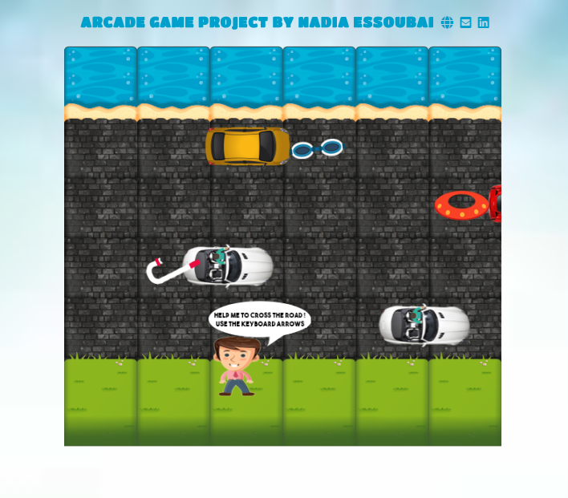

# Memory Game Project
Udacity Front-End Web Developer Nanodegree Project: Arcade Game

## How The Game Works
The goal is to collect all the accessories and to reach the beach without colliding into cars.
You can move left, right, up and down with the keyboard arrows.

You can play the game here : https://nadiaessou.github.io/project-arcade-game/

## Resources used to create the game:
Starter code of Udacity students  
HTML  
CSS  
Canvas  
Object Oriented JavaScript  
Pictures from Freepik (https://fr.freepik.com/) and retouched by me with Photoshop  
Help :  
https://www.w3schools.com/  
https://developer.mozilla.org/fr/  
https://discussions.udacity.com/  
Udacity Course "HTML5 Canvas"